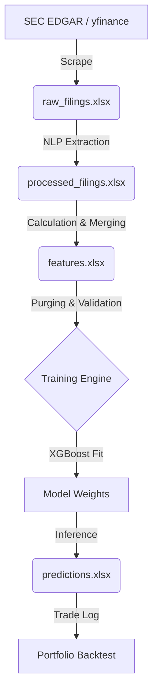

# Data Lifecycle: From SEC Filing to Price Prediction

This document provides a "Data POV" analysis of how raw corporate information is systematically transformed into a predictive signal. It covers the origin, transformation, and rigorous validation steps designed to prevent information leakage.

## 1. The Origin of the Feature Set

The system relies on two primary data streams:

- **Unstructured Textual Data**: Sourced from **SEC EDGAR**. The "Management's Discussion and Analysis" (MD&A) section of 10-Q forms is extracted using regex patterns. This is the source of "qualitative" features.
- **Structured Financial & Market Data**:
  - **Fundamental Metrics**: Revenue and Net Income are extracted directly from XBRL financial statements within the filings.
  - **Market Pricing**: Historical OHLCV data is fetched via **yfinance** for the target ticker and benchmark indices.

## 2. Feature Calculation & Engineering

Raw data is never fed directly into the model in its original state. Instead, it is transformed into stationary ratios and indicators using the following formulas:

### A. Sentiment Features (Text → Numbers)

The system converts unstructured text into quantitative probabilities using the **FinBERT** transformer model. Because MD&A sections often exceed 20,000 words, the system employs a **Chunk-Averaging** strategy:

1. **KISS Chunking**: The raw text is split into chunks ($c$) of approx. 400 words.
2. **Aggregation**: Final probabilities for a filing are the arithmetic mean of all chunks:
   $$
   P_{\text{label}} = \frac{1}{n} \sum_{i=1}^n P(\text{label} | c_i)
   $$
3. **Sentiment Score**: The primary scalar feature is:
   $$
   \text{Score} = P_{\text{pos}} - P_{\text{neg}}
   $$
4. **Sentiment Dynamics (QoQ Change)**:
   $$
   \Delta \text{Score}_t = \text{Score}_t - \text{Score}_{t-1}
   $$

### B. Financial Features

- **Revenue Growth**: Quarterly standardized growth rate.
  $$
  Growth = \frac{\text{Rev}_t - \text{Rev}_{t-1}}{\text{Rev}_{t-1}}
  $$
- **Net Margin**: Profitability efficiency.
  $$
  Margin = \frac{\text{Net Income}}{\text{Revenue}}
  $$

### C. Technical Indicators (Derived from OHLC)

**Critical Note on OHLC**: Scale-invariant prices ($P$) are **not** used as predictors. Only derived indicators that are "stationary" (relative measures) are included:

- **Relative Strength Index (RSI)**:

  $$
  RSI = \frac{\text{AvgGain}_{14}}{\text{AvgLoss}_{14}} \implies RSI = 100 - \left( \frac{100}{1 + RS} \right)
  $$
- **MACD (Moving Average Convergence Divergence)**:

  $$
  MACD = \text{EMA}(P)_{12} - \text{EMA}(P)_{26}
  $$
- **Relative Volatility**: A normalized measure of price dispersion on the filing day.

  $$
  Volatility = \frac{\text{High} - \text{Low}}{\text{Open} + \epsilon}
  $$

  *(Where $\epsilon$ is a small constant $1e-9$ to prevent division by zero).*

## 3. The Lifecycle: Journey of a Data Point

1. **Ingestion**: Raw HTML filings are converted to Markdown and stored with basic financial metadata.
2. **Transformation**: Sentiment models (local FinBERT or GPT-4o) process the text into scalar probabilities.
3. **Augmentation**: Historical price data is merged to calculate growth and future return targets.
4. **Purging**: Historical data points are filtered to ensure no training sample overlaps with a test sample's prediction window.
5. **Forecasting**: The latest "live" record (with an unknown outcome) is passed through the trained weights to generate a conviction score.

## 4. Addressing Data Leakage (The "Golden Rule")

In financial modeling, "leakage" occurs when information from the future is used to train a model about the past. To prevent this, the system implements three critical layers:

### Layer 1: Static NLP Models

We use **ProsusAI/finbert**, which was trained on pre-2020 data. This ensures the model's understanding of "good/bad" news isn't influenced by post-pandemic market regimes or specific recent events that haven't happened yet in the backtest timeline.

### Layer 2: Data Purging

When calculating a 90-day return, the outcome of a filing in **March **isn't known until **June**.

- If we train a model in **April**, we MUST NOT use the March sample, because its 90-day outcome is still "in the future" relative to April.
- The system checks: `(filing_date + lookahead) < current_decision_date`. Only "closed" trades are allowed in the training set.

### Layer 3: Purged Walk-Forward Cross-Validation

Instead of random splitting, we use a chronological split. The model is trained on everything up to Year $N$ and tested on Year $N+1$. This preserves the time-series nature of the market and prevents the model from seeing future price movements.

## 5. What exactly is Predicted?

The model is a **Regression Engine** designed to forecast the magnitude and direction of the stock's future price movement. It does not output a simple "Buy/Sell" classification; instead, it predicts a continuous float value representing the expected return.

### A. The Target Variable Formulation ($y$)

The dependent variable used for training and inference is the **arithmetic raw return** of the stock over a specific forward-looking horizon ($H$):

$$
y = \frac{P_{t+H} - P_t}{P_t}
$$

- **$P_t$ (Entry Price)**: The daily close price on the filing date. If the filing occurs on a weekend or after market hours, the system uses the first available price on or after that date.
- **$P_{t+H}$ (Exit Price)**: The daily close price exactly $H$ days after $P_t$.
- **$H$ (Horizon)**:
  - **Fundamental (90 Days)**: Aligned with the typical fiscal quarter cycle. This targets "Post-Earnings Announcement Drift" (PEAD) and long-term fundamental sentiment.
  - **Alpha/Momentum (5 Days)**: Targets the immediate short-term market reaction to the sentiment extracted from the filing.

### B. Predicted Return vs. Residual Alpha

While the model is trained on **raw returns**, its utility in a portfolio context effectively targets **Residual Alpha**. Because the feature set includes broad financial growth and specific corporate sentiment, the model attempts to capture the portion of the return that is idiosyncratic to the company (the "Alpha"), rather than just following general market beta.

### C. Conversion to Conviction Score

The raw output of the XGBoost regressor is treated as a **Conviction Score** ($\hat{y}$):

1. **Inference**: The model inputs the latest filing features and outputs a predicted return (e.g., `+0.045`).
2. **Filtering**: Any ticker with a prediction $\le 0$ is discarded.
3. **Portfolio Weighting**: For all tickers in the "Buy List" ($N$), the specific allocation weight ($w_i$) is calculated using identifying conviction:
   $$
   w_i = \frac{\hat{y}_i}{\sum_{j=1}^N \hat{y}_j}
   $$

   This ensures that 100% of the allocated capital is distributed among positive opportunities, skewed towards the highest expected returns.

### D. Performance Evaluation (Backtest Metrics)

To verify the validity of these predictions, the system calculates the **Sharpe Ratio** ($S$) of the portfolio returns ($R_p$):

$$
S = \frac{\text{Mean}(R_p) - R_f}{\text{StdDev}(R_p)}
$$

- $R_p$: The quarterly periodic returns generated by the weighting logic above.
- $R_f$: Risk-free rate (assumed 0.0 for conservative baseline).
- The ratio is annualized by multiplying by $\sqrt{4}$ (for quarterly) or $\sqrt{252}$ (for daily).

### E. Why Regression instead of Classification?

By predicting the **percentage return** rather than just a "Up/Down" label, the system can distinguish between a "Strong Buy" (high expected gain) and a "Weak Buy" (low expected gain). this allows for much more sophisticated portfolio optimization where the highest conviction ideas are given the most capital.
