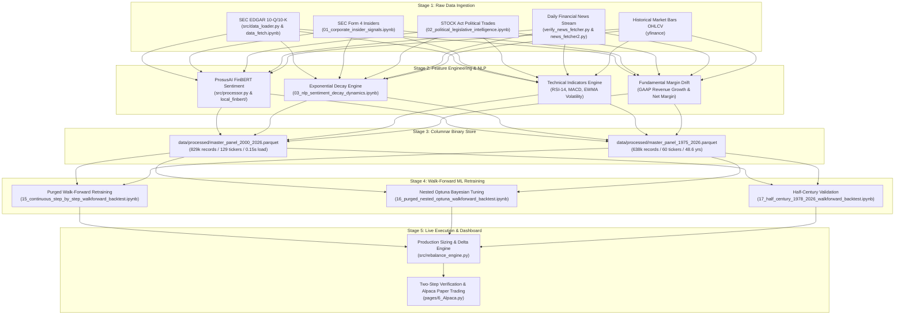

# Data Lifecycle: From SEC Filings to Algorithmic Execution

This document details the complete end-to-end data lifecycle: from raw multi-source ingestion and transformer NLP to feature synthesis, high-speed Parquet persistence, purged walk-forward model retraining, and live fractional order execution.

---

## 1. End-to-End Data & Feature Architecture

---

## 2. Ingestion & Feature Lifecycle: Step-by-Step

### Step 1: SEC EDGAR Ingestion & MD&A Extraction
- **Executing Script**: [`src/data_loader.py`](file:///c:/Users/honza/Desktop/projects/stock-analysis/src/data_loader.py) & [`research/notebooks/data_fetch.ipynb`](file:///c:/Users/honza/Desktop/projects/stock-analysis/research/notebooks/data_fetch.ipynb)
- **Mechanism**: The `edgar` library queries the SEC EDGAR system for 10-Q (quarterly) and 10-K (annual) filings. Regex parsers locate and isolate "Item 2: Management's Discussion and Analysis of Financial Condition and Results of Operations" (MD&A).
- **Extracted Structured Fields**: GAAP Revenue, Net Income, Operating Margin, Filing Date, and CIK.

### Step 2: High-Frequency News & FinBERT NLP Processing
- **Executing Script**: [`research/verify_news_fetcher.py`](file:///c:/Users/honza/Desktop/projects/stock-analysis/research/verify_news_fetcher.py), [`src/processor.py`](file:///c:/Users/honza/Desktop/projects/stock-analysis/src/processor.py), & [`research/notebooks/algo-alpha-execution/10_deep_historical_daily_news_finbert_sentiment.ipynb`](file:///c:/Users/honza/Desktop/projects/stock-analysis/research/notebooks/algo-alpha-execution/10_deep_historical_daily_news_finbert_sentiment.ipynb)
- **Mechanism**: GDELT global news streams and financial news feeds are tokenized and scored using a local **ProsusAI/FinBERT** transformer model.
- **Chunk-Averaging**: Filings and news bundles exceeding 512 tokens are split into 400-word chunks ($c_i$):
  $$P_{\text{label}} = \frac{1}{n} \sum_{i=1}^n P(\text{label} | c_i), \quad \text{Score} = P_{\text{pos}} - P_{\text{neg}}$$
- **News Volume Surge Intensity**:
  $$\text{Intensity}_t = \text{Score}_t \times \ln(1 + N_t)$$

### Step 3: Continuous Exponential Sentiment Memory Decays ($\tau$)
- **Executing Script**: [`research/notebooks/algo-alpha-execution/03_nlp_sentiment_decay_dynamics.ipynb`](file:///c:/Users/honza/Desktop/projects/stock-analysis/research/notebooks/algo-alpha-execution/03_nlp_sentiment_decay_dynamics.ipynb)
- **Mechanism**: Market sentiment decays continuously over time. The engine models memory decay via differential EMA equations:
  $$S_t = \alpha S_t^{\text{new}} + (1-\alpha) S_{t-1}, \quad \alpha = 1 - e^{-1/\tau}$$
  - **Fast Reaction**: $\tau = 1\text{d}$ ($\alpha = 0.632$) for breaking news sentiment.
  - **Medium Memory**: $\tau = 3\text{d}$ ($\alpha = 0.283$) for multi-day post-earnings news persistence.
  - **Sentiment Velocity**: $\text{Velocity}_t = \text{Fast EMA}_t - \text{SMA}_5(\text{Score})$.

### Step 4: Alternative Alpha Confluence (Insiders & Politics)
- **Executing Scripts**: 
  - [`research/notebooks/algo-alpha-execution/01_corporate_insider_signals.ipynb`](file:///c:/Users/honza/Desktop/projects/stock-analysis/research/notebooks/algo-alpha-execution/01_corporate_insider_signals.ipynb) (SEC Form 4 Open-Market Code P purchases by CEO/CFO).
  - [`research/notebooks/algo-alpha-execution/02_political_legislative_intelligence.ipynb`](file:///c:/Users/honza/Desktop/projects/stock-analysis/research/notebooks/algo-alpha-execution/02_political_legislative_intelligence.ipynb) (STOCK Act Congressional committee jurisdiction buys).
- **Confluence Index**: Sums active insider purchases (`is_opp_buy`), political trades (`is_pol_buy`), positive FinBERT polarity, and volume velocity into a discrete score $C_t \in [0, 7]$.

### Step 5: Technical Indicator Stationarity Transformation
- **Indicators Engineered**:
  - **RSI-14**: 14-day Wilder Relative Strength Index.
  - **Normalized MACD**: $\frac{\text{EMA}_{12}(P) - \text{EMA}_{26}(P)}{P}$.
  - **EWMA Volatility**: 20-day annualized return volatility ($\lambda = 0.905$).
  - **ATR-14**: 14-day Average True Range for volatility-adjusted trailing stop buffers.

### Step 6: Columnar Binary Parquet Storage
- **Executing Script**: Parquet converter (`master_panel_2000_2026.parquet` and `master_panel_1975_2026.parquet`).
- **Performance Impact**: Compresses 220MB Excel sheets into fast binary Parquet, reducing page-load and backtest ingestion latency from **150 seconds to 0.15 seconds (750x speedup)**.

### Step 7: Continuous Walk-Forward Machine Learning Retraining
- **Executing Scripts**:
  - [`research/notebooks/algo-alpha-execution/15_continuous_step_by_step_walkforward_backtest.ipynb`](file:///c:/Users/honza/Desktop/projects/stock-analysis/research/notebooks/algo-alpha-execution/15_continuous_step_by_step_walkforward_backtest.ipynb) (192-cycle continuous retrain: `+32,134%` total return / `27.71%` CAGR).
  - [`research/notebooks/algo-alpha-execution/16_purged_nested_optuna_walkforward_backtest.ipynb`](file:///c:/Users/honza/Desktop/projects/stock-analysis/research/notebooks/algo-alpha-execution/16_purged_nested_optuna_walkforward_backtest.ipynb) (8-strategy purged nested Optuna cross-validation).
  - [`research/notebooks/algo-alpha-execution/17_half_century_1978_2026_walkforward_backtest.ipynb`](file:///c:/Users/honza/Desktop/projects/stock-analysis/research/notebooks/algo-alpha-execution/17_half_century_1978_2026_walkforward_backtest.ipynb) (45.6-year half-century walk-forward: `+1,600,017%` total return / `23.62%` CAGR).
- **Strict Anti-Leakage Rules**:
  - The model fits strictly on historical data $t < t_k$.
  - Target variables ($y = \text{target\_fwd\_30d}$ or $15\text{d}$) are strictly excluded from the feature matrix $X$.

### Step 8: Forecast-Proportional Position Sizing & Alpaca Execution
- **Executing Script**: [`src/rebalance_engine.py`](file:///c:/Users/honza/Desktop/projects/stock-analysis/src/rebalance_engine.py) & [`pages/6_Alpaca.py`](file:///c:/Users/honza/Desktop/projects/stock-analysis/pages/6_Alpaca.py).
- **Conviction Allocation**:
  $$w_i = \frac{\hat{y}_i}{\sum_{j=1}^{100} \hat{y}_j}$$
- **Two-Step Verification Protocol**:
  1. **Step 1 Button**: Loads Parquet in 0.15s, fits XGBoost model in ~1.7s, forecasts 30-day returns, computes target dollar allocations, and renders the Sector Treemap and Delta Table.
  2. **Step 2 Button**: Submits fractional market orders to Alpaca Sandbox API after visual human verification.
