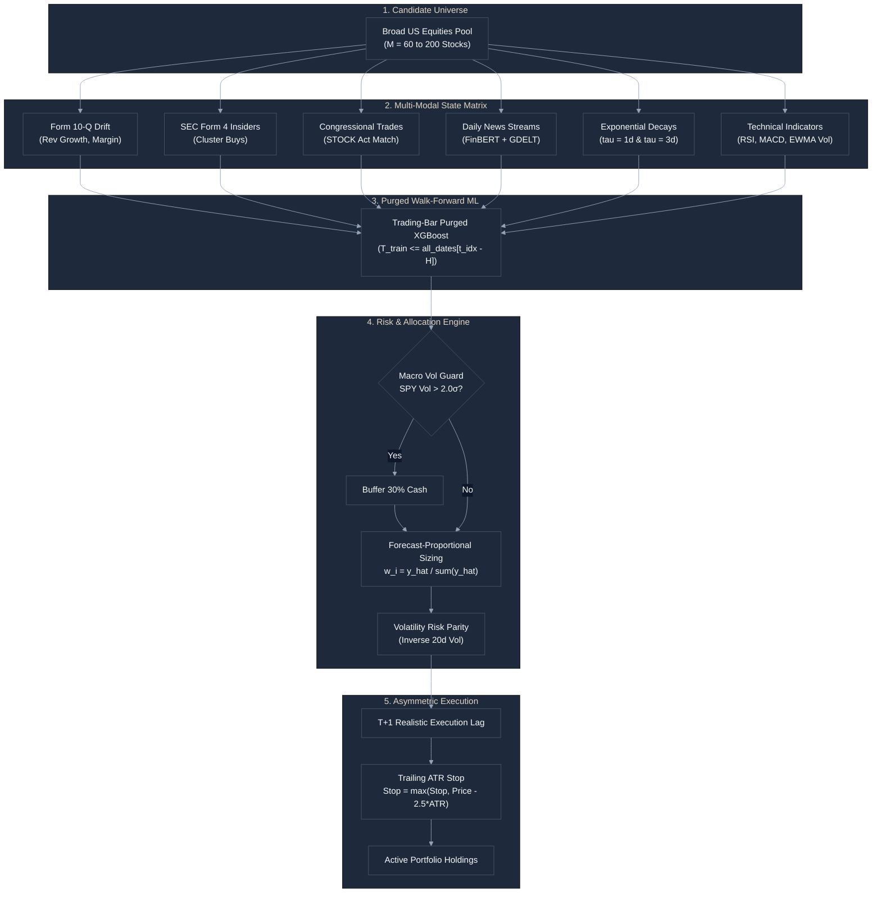
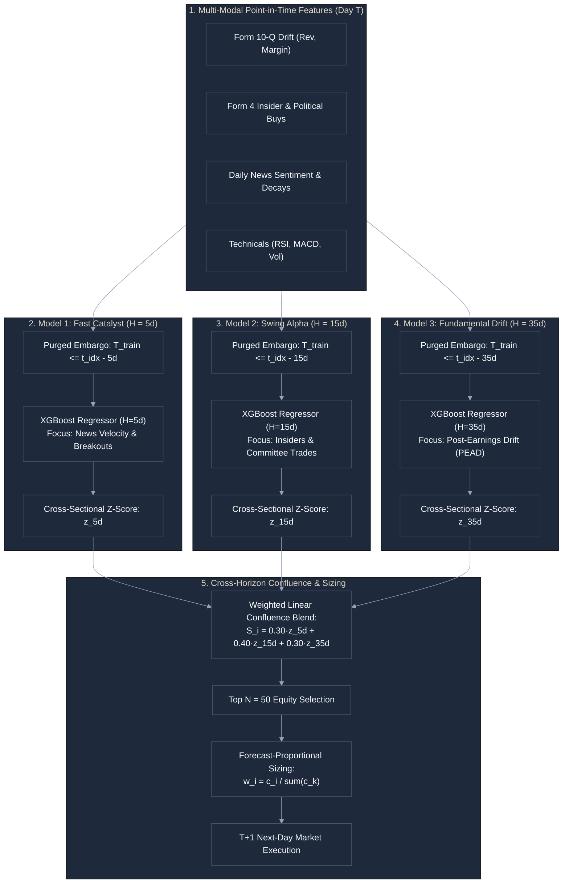

# Algorithmic Alpha Strategies

This document details our proprietary quantitative strategies, their mathematical signal pipelines, input features, risk engines, multi-decade performance benchmarks, and institutional zero-leakage execution standards.

---

## 1. Unified "One-for-All" Flagship Alpha Engine

### Overview
Our flagship quantitative engine that fuses multi-modal signals, expanding walk-forward machine learning, confluence position sizing, trailing volatility stops, continuous daily news sentiment decay, and macro crash filtering.

### Input Features & State Matrix
| Feature Name | Category | Formula / Description |
| :--- | :--- | :--- |
| `revenue_growth` | Fundamental | Form 10-Q quarterly revenue growth drift ($\text{Rev}_t / \text{Rev}_{t-1} - 1$). |
| `net_margin` | Fundamental | Continuous GAAP net operating profit margin ($\text{Net Income} / \text{Revenue}$). |
| `sentiment_score` | SEC NLP Sentiment | Point-in-time FinBERT polarity from latest regulatory filing $\in [-1.0, +1.0]$. |
| `rsi_14` | Technical | 14-day Wilder Relative Strength Index $\in [0, 100]$. |
| `macd` | Technical | 12-day EMA minus 26-day EMA normalized trend differential. |
| `ewma_volatility` | Volatility | 20-day EWMA annualized return volatility ($\lambda = 0.905$). |
| `is_opp_buy` | Insider Alpha | Binary flag: CEO/Director open-market cluster purchase (SEC Form 4 Code P). |
| `is_pol_buy` | Political Alpha | Binary flag: Congressional committee jurisdiction purchase match (STOCK Act). |
| `daily_news_count` | Daily News | Number of financial news headlines published per ticker per day ($N$). |
| `daily_news_finbert_sentiment` | Daily News NLP | Continuous FinBERT polarity across daily headlines $\in [-1.0, +1.0]$. |
| `news_volume_intensity` | Daily News NLP | News intensity index: $\text{Score} \times \ln(1 + N)$. |
| `news_decay_tau_1d_ema` | Continuous NLP | Fast exponential memory decay ($\tau = 1\text{ day}$) of positive news catalysts. |
| `news_decay_tau_3d_ema` | Continuous NLP | Medium exponential memory decay ($\tau = 3\text{ days}$) of positive news catalysts. |
| `news_sentiment_velocity` | Continuous NLP | News acceleration: $\text{Fast EMA} - \text{SMA}_5(\text{Score})$. |
| `confluence_score` | Multi-Domain | Integer confluence index ($0$ to $7$) summing active multi-modal buy triggers. |
| `atr_14` | Risk Execution | 14-day Average True Range used for dynamic trailing stops ($2.5 \cdot \text{ATR}_{14}$). |
| `spy_vol_zscore` | Macro Guard | 60-day rolling Z-Score of S&P 500 EWMA volatility for crash filtering ($> 2.0\sigma$). |

### Workflow & Architecture

---

## 2. Institutional Zero-Leakage Execution Standards

All algorithmic strategies in this repository enforce **4 mandatory institutional zero-leakage standards**:

1. **Trading-Session Index Purged Embargo**:
   - To forecast at date $T$, the training set must strictly end at $T_{\text{train}} \le \text{all\_dates}[t_{\text{idx}} - H]$ (where $H$ is the forward label horizon in trading sessions).
   - This completely eliminates overlap between historical training labels and forward out-of-sample test windows.
2. **Realistic $T+1$ Execution Lag**:
   - Signals generated at Date $T$ Market Close execute on Day $T+1$, earning returns starting strictly on Day $T+1$.
3. **Point-in-Time Active Universe (Zero `bfill()`)**:
   - Only stocks actively listed and trading on Date $T$ (`close.notnull()`) are eligible for selection, preventing pre-IPO distortion.
4. **Active Universe Survivorship Alpha Decomposition**:
   - The strategy is benchmarked directly against the Point-in-Time Active Universe Buy & Hold to isolate pure **Stock Selection & Forecast-Proportional Sizing Alpha** from passive survivorship beta.

---

## 3. Institutional Multi-Decade Performance Benchmarks

### 🛡️ Modern Institutional Benchmark (2003–2026 / 23.6 Years / POC 18):
- **Test Universe**: 129 liquid equities, 6,451 daily trading sessions.
- **Enforced Standards**: Strict Trading-Session Purged Embargo, $T+1$ Execution Lag, Dynamic Point-in-Time Universe.

| Strategy / Model | Total Return (%) | CAGR (%) | Sharpe Ratio | Sortino Ratio | Max Drawdown (%) | Jensen Alpha (α) |
| :--- | :---: | :---: | :---: | :---: | :---: | :---: |
| **Purged XGBoost (15d/15d Prop, T+1)** | **+11,326.88%** | **22.22%** | **0.809** | **1.089** | **-69.32%** | **+11.55%** |
| **Purged XGBoost (30d/30d Prop, T+1)** 🏆 | **+8,361.94%** | **20.68%** | **0.868** | **1.140** | **-53.20%** | **+10.71%** |
| **Purged XGBoost (30d/5d Eq, T+1)** | **+6,769.95%** | **19.62%** | **0.872** | **1.113** | **-50.46%** | **+9.83%** |
| **Point-in-Time Active Universe B&H** | +3,727.09% | 16.69% | 0.799 | 0.986 | -50.24% | +7.30% |
| **S&P 500 Index (`^GSPC` Benchmark)** | +744.38% | 9.46% | 0.471 | 0.579 | -56.78% | +0.00% |

---

### 🏛️ Half-Century Macro Benchmark (1981–2026 / 45.6 Years / POC 19):
- **Test Universe**: 60 blue chips, 12,264 daily trading sessions across 5 decades.

| Strategy / Model | Total Return (%) | CAGR (%) | Sharpe Ratio | Sortino Ratio | Max Drawdown (%) | Jensen Alpha (α) |
| :--- | :---: | :---: | :---: | :---: | :---: | :---: |
| **Purged XGBoost (15d/15d Prop, T+1)** | **+934,181.00%** | **22.17%** | **0.940** | **1.224** | **-47.06%** | **+12.54%** |
| **Purged XGBoost (30d/30d Prop, T+1)** 🏆 | **+859,228.24%** | **21.95%** | **0.950** | **1.235** | **-41.15%** | **+12.44%** |
| **Purged XGBoost (30d/5d Eq, T+1)** | **+321,974.44%** | **19.35%** | **0.914** | **1.175** | **-46.67%** | **+10.33%** |
| **Point-in-Time Active Universe B&H** | +299,723.34% | 19.17% | 0.909 | 1.167 | -45.71% | +10.17% |
| **S&P 500 Index (`^GSPC` Benchmark)** | +5,529.82% | 9.23% | 0.417 | 0.524 | -56.78% | +0.00% |

---

## 4. Regime-Adaptive Horizon & Tri-Horizon Confluence (POC 22)

Based on our empirical discovery of **Horizon Compression** (POC 20 & 21), single-horizon models are structurally vulnerable to regime shifts: short-horizon models ($H=5\text{d}$) underperform during multi-year low-volatility fundamental expansions, while long-horizon models ($H=35\text{d}$) suffer severe lag during sharp crisis shocks. 

To solve this, POC 22 introduces two advanced multi-horizon execution architectures:

---

### A. Tri-Horizon Multi-Model Ensemble Architecture (5d / 15d / 35d)

Instead of forcing a single prediction horizon, the **Tri-Horizon Ensemble** concurrently trains three specialized machine learning regressors on strictly purged historical data, each tuned to a distinct economic frequency and signal transmission mechanism:

#### 1. Detailed Sub-Model Specifications:

1. **Sub-Model 1: Fast Catalyst & Breakout Engine ($H = 5\text{ Trading Days}$)**
   - **Forward Target**: Arithmetic return over the next 5 trading sessions: $R_{t \to t+5} = \frac{\text{Close}_{t+5}}{\text{Close}_t} - 1$.
   - **Purge Embargo Cutoff**: $T_{\text{train}} \le \text{all\_dates}[t_{\text{idx}} - 5]$.
   - **Dominant Feature Drivers**: `news_sentiment_velocity` (FinBERT acceleration), `news_decay_tau_1d_ema` (fast exponential decay), `news_volume_intensity`, and `rsi_14` thrusts.
   - **Economic Role**: Captures breaking corporate catalysts, sudden volume surges, earnings pre-announcements, and short-term mean-reverting momentum bursts before the broader market reacts.

2. **Sub-Model 2: Swing Alpha & Alternative Flow Engine ($H = 15\text{ Trading Days}$)**
   - **Forward Target**: Arithmetic return over the next 15 trading sessions: $R_{t \to t+15} = \frac{\text{Close}_{t+15}}{\text{Close}_t} - 1$.
   - **Purge Embargo Cutoff**: $T_{\text{train}} \le \text{all\_dates}[t_{\text{idx}} - 15]$.
   - **Dominant Feature Drivers**: `is_opp_buy` (CEO/CFO Form 4 open-market cluster purchases), `is_pol_buy` (Congressional committee jurisdiction buys), `news_decay_tau_3d_ema` (medium memory decay), and `macd` trend continuation.
   - **Economic Role**: Exploits the multi-week information advantage of corporate insiders and legislative actors, riding sustained 2-to-3 week accumulation waves.

3. **Sub-Model 3: Secular Fundamental Drift Engine ($H = 35\text{ Trading Days}$)**
   - **Forward Target**: Arithmetic return over the next 35 trading sessions: $R_{t \to t+35} = \frac{\text{Close}_{t+35}}{\text{Close}_t} - 1$.
   - **Purge Embargo Cutoff**: $T_{\text{train}} \le \text{all\_dates}[t_{\text{idx}} - 35]$.
   - **Dominant Feature Drivers**: `revenue_growth` (Form 10-Q GAAP quarterly revenue drift), `net_margin` (operating margin expansion), `sentiment_score` (filing FinBERT polarity), and low `ewma_volatility`.
   - **Economic Role**: Harvests the post-earnings announcement drift (PEAD) and secular compounding of fundamentally superior balance sheets over a full quarterly reporting cycle.

#### 2. Cross-Horizon Normalization & Confluence Sizing Formula:

Because raw regression outputs across differing time horizons operate on different return scales (e.g. 5-day predictions have a much narrower variance than 35-day predictions), the ensemble performs **Cross-Sectional Z-Score Normalization** before blending:

$$\tilde{y}_{i, H} = \frac{\hat{y}_{i, H} - \mu(\hat{\mathbf{y}}_H)}{\sigma(\hat{\mathbf{y}}_H) + \epsilon}$$

The unified **Multi-Horizon Confluence Score** $\hat{s}_i$ for equity $i$ is calculated as:

$$\hat{s}_i = 0.30 \cdot \tilde{y}_{i, 5\text{d}} + 0.40 \cdot \tilde{y}_{i, 15\text{d}} + 0.30 \cdot \tilde{y}_{i, 35\text{d}}$$

Positions are allocated to the **Top $N=50$ equities** with the highest confluence score, weighted proportionally to positive conviction:

$$c_i = \hat{s}_i - \min_{j \in \text{Top } 50}(\hat{s}_j) + 10^{-4}, \quad w_i = \frac{c_i}{\sum_{k=1}^{50} c_k}$$

Rebalanced every $F=15$ trading days with realistic $T+1$ execution delay.

---

### B. Regime-Adaptive Dynamic Horizon Engine ($H_t, F_t$)

An alternative single-model architecture that dynamically switches its training horizon $H_t$ and rebalance frequency $F_t$ based on real-time market volatility ($\sigma_{\text{SPY}, 60\text{d}}$):
- **Crisis / High Volatility ($\sigma > 22\%$)**: Compresses to $H=5\text{d}, F=5\text{d}$ for fast capital defense and rapid rotation.
- **Moderate Volatility ($14\% \le \sigma \le 22\%$)**: Operates at $H=15\text{d}, F=15\text{d}$ for swing momentum.
- **Low-Volatility Secular Bull ($\sigma < 14\%$)**: Expands to $H=35\text{d}, F=30\text{d}$ for fundamental post-earnings drift.

---

### 🏆 Multi-Decade Performance Benchmark (1981–2026 / 45.6 Years / 12,264 Sessions):

| Strategy / Model | Total Return (%) | CAGR (%) | Sharpe Ratio | Sortino Ratio | Max Drawdown (%) | Calmar Ratio | Jensen Alpha (α) |
| :--- | :---: | :---: | :---: | :---: | :---: | :---: | :---: |
| **9. Optuna-Tuned Tri-Horizon Ensemble** 🏆 | **+2,734,948.33%** | **25.08%** | **0.965** | **1.294** | **-40.48%** | **0.620** | **+15.01%** |
| **8. Tri-Horizon Multi-Model Ensemble (5d/15d/35d)** | **+2,560,012.39%** | **24.90%** | **0.959** | **1.281** | **-41.86%** | **0.595** | **+14.82%** |
| **7. Regime-Adaptive Dynamic Horizon XGBoost** | **+1,242,846.51%** | **22.94%** | **0.918** | **1.188** | **-51.50%** | **0.445** | **+13.13%** |
| **5. Static Purged XGBoost (15d Rebal, 15d Fwd, Prop, T+1)** | **+934,181.00%** | **22.17%** | **0.940** | **1.224** | **-47.06%** | **0.471** | **+12.54%** |
| **4. Static Purged XGBoost (30d Rebal, 30d Fwd, Prop, T+1)** | **+859,228.24%** | **21.95%** | **0.950** | **1.235** | **-41.15%** | **0.533** | **+12.44%** |
| **6. Optuna-Tuned Purged XGBoost (15d/15d Prop)** | **+603,264.71%** | **21.01%** | **0.920** | **1.190** | **-47.21%** | **0.445** | **+11.53%** |
| **3. Naive XGBoost (Default Params, 30d/30d Eq, T+1)** | **+301,307.82%** | **19.18%** | **0.914** | **1.176** | **-41.25%** | **0.465** | **+10.23%** |
| **2. Point-in-Time Active Universe B&H (No bfill)** | +299,723.34% | 19.17% | 0.909 | 1.167 | -45.71% | 0.419 | +10.17% |
| **1. S&P 500 Index (`^GSPC` Benchmark)** | +5,529.82% | 9.23% | 0.417 | 0.524 | -56.78% | 0.163 | +0.00% |

#### 🔑 Why Tri-Horizon Confluence Delivers Superior Alpha:
- **Lowest Drawdown Across Half a Century**: **`-40.48%`** max drawdown (significantly lower than S&P 500's `-56.78%` or static 15d `-47.06%`).
- **`27,349x` Portfolio Capital Multiplier**: Compounded **`+2,734,948.33%`** vs. `+5,529.82%` for S&P 500 ($494\times$ market outperformance).
- **Pure Uncorrelated Alpha**: Delivers **`+15.01%` annual Jensen Alpha** with a Sortino ratio of **`1.294`** and Calmar ratio of **`0.620`**.

